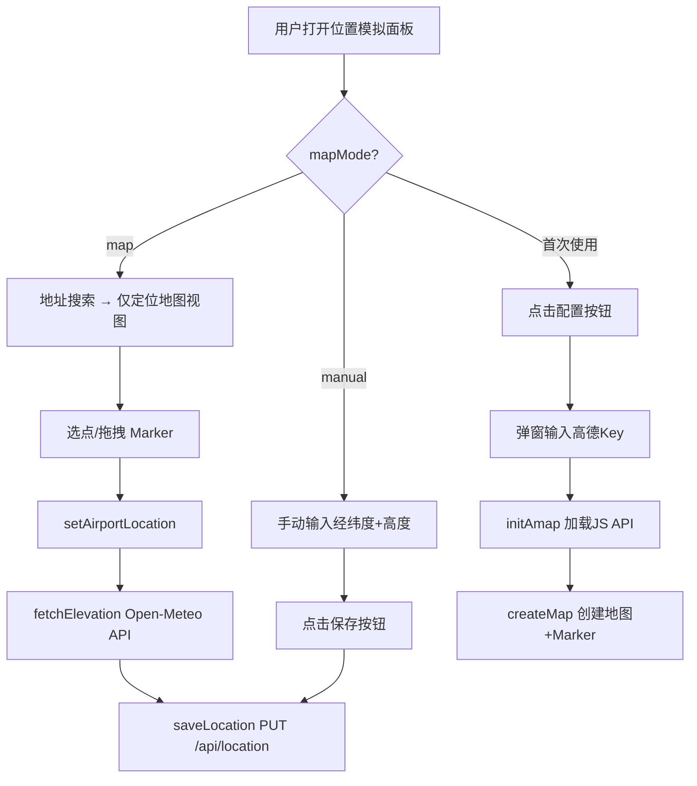
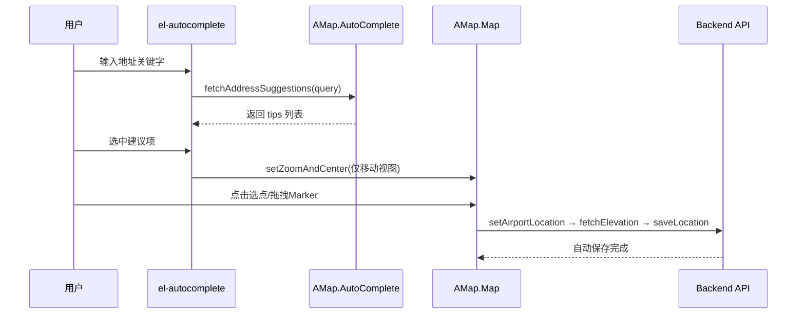
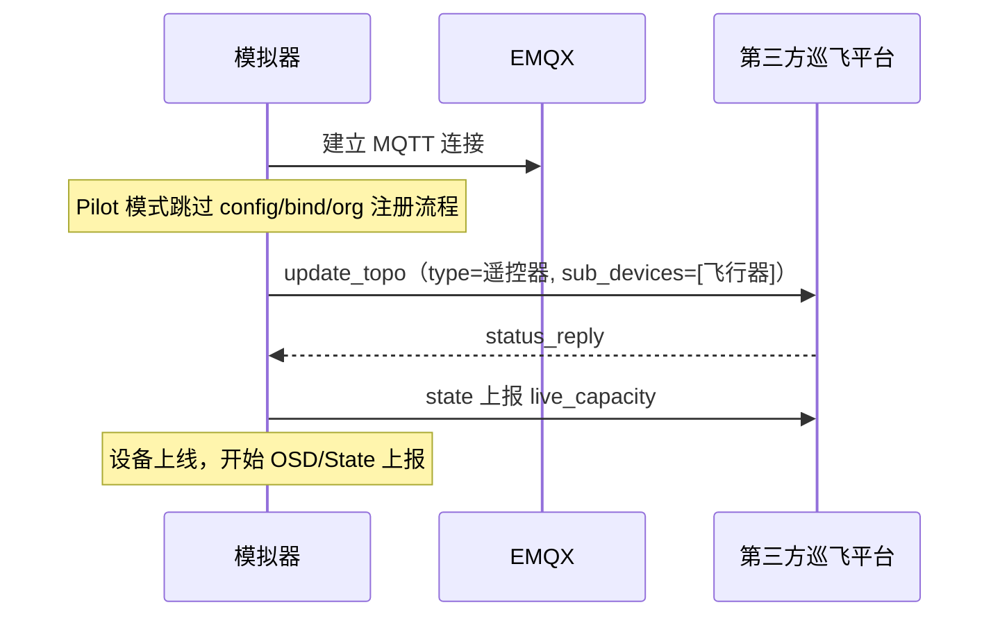
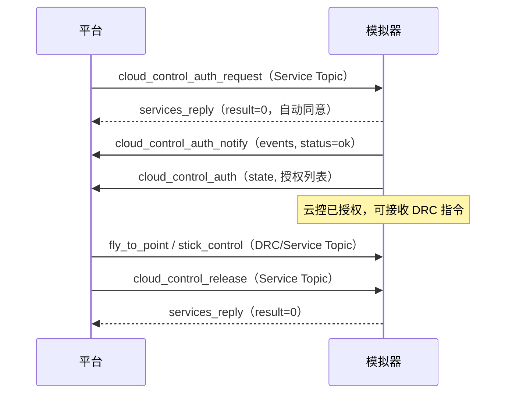

# DJI Dock 机场模拟器设计文档

- 日期：2026-08-08（2026-08-09 更新）
- 状态：已批准
- 定位：开发期临时占位（低保真、快速可用）

## 1. 背景与目标

hivemind 是无人机自主作业平台，已通过 `adapter-drone` 模块按 DJI Cloud API 经 MQTT(EMQX) 与真实大疆机场通信。开发期缺少真实硬件，需要一个模拟器伪装成一台 Dock + 以及内置飞行器 设备组，让平台能在无硬件环境下跑通设备上线、状态上报、航线任务、直播应答、媒体上传的核心闭环。

**成功标准**：启动模拟器 → 在巡飞平台看到设备上线 → 下发航线任务能走通"下发→执行→完成→媒体上报"全流程 → 直播命令能正常应答。

### 项目定位

1. **设备模拟**：让巡飞平台开发测试不必依赖真实机场硬件，降低开发门槛与成本
2. **调试工具（核心价值）**：比真机更快捷地验证开发代码的正确性——状态可控、场景可复现、迭代周期短

> 所有设计与实现决策都必须围绕"更快验证平台代码正确性"这一核心价值展开，避免脱离调试工具定位的设计偏题。

### 开发原则

- **共性优先**：遇到问题先分析是否为同类共性问题，架构优化能解决的优先提供优化建议（经确认后执行），不打补丁式修改

## 2. 架构总览

自包含 Spring Boot 应用，位于 `hivemind-simulator/` 目录。作为 MQTT 客户端连接 hivemind 的 EMQX broker，伪装成 DJI 机场+飞行器设备组（通过 `DeviceType` 枚举支持 Dock1/2/3 + M30/M30T/M3D/M3TD/M4D/M4TD，默认 Dock3+M4TD）。内嵌静态 Web 控制台（Vue 3 CDN，单 HTML），浏览器即可控制模拟机场行为。

```
┌─────────────────────────────────────────────┐
│         DJI Dock Simulator (Spring Boot)    │
│  ┌──────────────┐    ┌──────────────────┐   │
│  │ MQTT 引擎     │◄──►│ 设备状态机        │   │
│  └──────┬───────┘    └────────┬─────────┘   │
│  ┌──────┴───────┐    ┌────────┴─────────┐   │
│  │ 协议处理器    │    │ 任务模拟引擎      │   │
│  └──────────────┘    └──────────────────┘   │
│  ┌──────────────────────────────────────┐   │
│  │ Web 控制台 (REST + 静态HTML/Vue CDN)  │   │
│  └──────────────────────────────────────┘   │
└─────────────────┬───────────────────────────┘
                  │ MQTT (EMQX)
                  ▼
┌─────────────────────────────────────────────┐
│         hivemind 平台 (adapter-drone)        │
└─────────────────────────────────────────────┘
```

## 3. 核心组件

| 组件 | 职责 |
|---|---|
| `MqttClientManager` | 模拟器 MQTT 连接管理：连接 EMQX，订阅 services/property-set/events_reply/requests_reply/status_reply，发布到对应上行 topic |
| `MonitorMqttClient` | 监控器独立 MQTT 客户端 |
| `MonitorService` | 监控器消息处理 |
| `DeviceState` | Dock + Drone 的模拟状态模型（在线/离线、电量、温湿度、位置、舱盖/推杆/充电等） |
| `DeviceSimulator` | 状态维护 + 0.5Hz OSD 定时上报（dock osd 始终推送，drone osd 仅 `droneActivated=true` 时推送） |
| `DockOnlineService` | 上云注册 + 上线流程：config → airport_bind_status → airport_organization_get → airport_organization_bind → update_topo |
| `DeviceType` | 设备类型枚举：封装 (domain, type, sub_type) 三元组，提供机场/飞行器型号管理、model_key 解析、机场-飞行器兼容性校验、内置默认 SN（`defaultSn()`） |
| `PayloadType` | 负载类型枚举：封装 (type, subtype, gimbalindex)，覆盖飞行器主相机、通用云台负载、FPV 相机、机场相机 |
| `OsdStrategy` | OSD 序列化策略接口：`convertKey()` 转换字段命名风格、`version()` 标识协议版本；Dock3 用 snake_case，Dock1/Dock2 用 camelCase |
| `ServiceCommandHandler` | 收到云端 services 命令，路由到对应处理器并回 services_reply |
| `PropertySetHandler` | property/set 应答 |
| `WaylineTaskSimulator` | 航线任务模拟：flighttask_prepare 回复 → flighttask_execute 异步推进 flighttask_progress → 完成后触发媒体上传。无人机位置随飞行步骤更新（起飞=机场位置、航线执行中=机场+偏移、降落=机场位置），任务完成后重置为机场位置 |
| `LiveStreamSimulator` | 直播模拟（[live.html](https://developer.dji.com/doc/cloud-api-tutorial/cn/api-reference/dock-to-cloud/mqtt/dock/dock3/live.html)）：live_start_push/stop_push/set_quality 同步应答 + 推流状态管理，live_camera_change（仅 Dock2+3）解析 camera_position，live_lens_change 解析 video_type，三 Dock 差异校验 |
| `FfmpegWhipPusher` | FFmpeg WHIP/RTMP 推流能力检测与执行：启动时检测本机 ffmpeg 是否支持 whiptp/rtmp muxer，提供 `getCapability()` 供前端展示限制清单 |
| `FfmpegInstaller` | FFmpeg 一键安装（Windows winget）：执行 `winget install ffmpeg`，安装后自动查找 ffmpeg.exe 路径，支持 SSE 进度推送 |
| `MediaUploadSimulator` | 媒体上传：storage_config_get 请求 → STS 凭证解析 → S3 文件上传 → file_upload_callback 事件上报 |
| `MediaUploader` | S3 兼容文件上传：使用 STS 凭证上传文件到对象存储（支持 ali/aws/minio/obs，从 endpoint 提取签名 region） |
| `HmsSimulator` | HMS 告警上报（基于 hms.json 错误码映射） |
| `RemoteDebugSimulator` | 远程调试模拟（[cmd.html](https://developer.dji.com/doc/cloud-api-tutorial/cn/api-reference/dock-to-cloud/mqtt/dock/dock3/cmd.html)）：同步 Cmd 指令（debug_mode/light/battery/alarm 等仅回 result=0）+ 异步 Job 指令（cover/drone/charge/putter/reboot/format/esim/rtk 进度事件 in_progress→ok + percent + 状态同步），区分 Dock1/Dock2/Dock3 指令集差异 |
| `FlightCommandSimulator` | 指令飞行模拟（[drc.html](https://developer.dji.com/doc/cloud-api-tutorial/cn/api-reference/dock-to-cloud/mqtt/dock/dock3/drc.html)）：fly_to_point/takeoff_to_point 指令应答 + 专用进度事件（fly_to_point_progress/takeoff_to_point_progress），flight_authority_grab/payload_authority_grab 同步应答 |
| `DrcCommandHandler` | DRC 远程控制指令路由（[remote-control.html](https://developer.dji.com/doc/cloud-api-tutorial/cn/api-reference/dock-to-cloud/mqtt/dock/dock3/remote-control.html)）：订阅 drc/down，按 method 路由（joystick/osd/voice 等），统一回 drc/up |
| `SimulatorController` | 模拟器 REST API：注册/上下线、修改状态参数、触发任务、查看日志 |
| `MonitorController` | 监控器 REST API |
| `PageController` | 返回内嵌 index.html / monitor.html |
| `SimulatorProperties` | 配置绑定（device/location/log/live） |
| `MqttProperties` | MQTT 配置绑定（顶层共享，模拟器与监控器共用连接参数） |
| `RuntimeConfig` | 运行时可变配置（前端 REST API 覆盖）：MQTT 参数、组织ID/绑定码/设备型号/SN/直播推流/媒体上传/机场位置 |
| `LiveConfigStore` | Live 推流 + 媒体上传 + 机场位置配置持久化（`~/.hivemind-simulator/live-config.json`，启动加载/变更保存） |

## 4. DJI Cloud API 时序图

### 4.1 机场上云注册时序

> 来源：https://developer.dji.com/doc/cloud-api-tutorial/cn/feature-set/dock-feature-set/dock-access-to-cloud.html

参与方：DJI Pilot 2、DJI Dock、Cloud Server

```
1. 填写 MQTT 网关地址、MQTT 账号密码
2. License 校验
   ├─ 校验成功 → 继续
   └─ 校验失败 → opt[后续组织绑定流程不进行]
3. 组织绑定（预查询）
   ├─ 查询设备绑定信息
   ├─ 查询对应的组织信息
   └─ 设备绑定到组织（opt[若设备未绑定]）
4. MQTT 连接建立
5. 请求 License 校验所需参数
   ├─ Topic: thing/product/{gateway_sn}/requests        Method: config
   └─ Topic: thing/product/{gateway_sn}/requests_reply  Method: config
      返回字段: app_id, app_key, app_license, ntp_server_host, ntp_server_port
6. MQTT 连接断开请求
7. 设备绑定信息获取
   ├─ Topic: thing/product/{gateway_sn}/requests        Method: airport_bind_status
   └─ Topic: thing/product/{gateway_sn}/requests_reply  Method: airport_bind_status
8. 请求设备绑定码对应的组织信息
   ├─ Topic: thing/product/{gateway_sn}/requests        Method: airport_organization_get
   └─ Topic: thing/product/{gateway_sn}/requests_reply  Method: airport_organization_get
      result=210229 表示绑定码错误
9. 通过设备绑定码将设备绑定到对应组织
   ├─ Topic: thing/product/{gateway_sn}/requests        Method: airport_organization_bind
   └─ Topic: thing/product/{gateway_sn}/requests_reply  Method: airport_organization_bind
      result=210229 表示绑定码错误
```

**注意**：update_topo 不属于机场上云注册流程，注册成功后才执行上线（见 §4.2）。

### 4.2 开机上线时序

> 来源：https://developer.dji.com/doc/cloud-api-tutorial/cn/feature-set/dock-feature-set/dock-device-management.html

参与方：Aircraft、DJI Dock、Cloud Server

```
1. 设备与网关通信连接，设备上线
2. 设备拓扑更新（上线）
   ├─ Topic: sys/product/{gateway_sn}/status        Method: update_topo（sub_devices 非空）
   └─ Topic: sys/product/{gateway_sn}/status_reply  Method: update_topo
      返回字段: data.result（非 0 代表错误）
3. loop[osd 属性 0.5HZ 定频推送]
   ├─ 飞行器属性推送  Topic: thing/product/{device_sn}/osd
   └─ 机场属性推送    Topic: thing/product/{device_sn}/osd
4. opt[state 属性 事件性上报]
   ├─ 飞行器属性推送  Topic: thing/product/{device_sn}/state
   └─ 机场属性推送    Topic: thing/product/{device_sn}/state
5. 设备属性设置
   ├─ Topic: thing/product/{gateway_sn}/property/set       （变更命令下发）
   ├─ 设备属性变更
   └─ Topic: thing/product/{gateway_sn}/property/set_reply（飞行器响应）
6. 设备与网关设备通信断开，设备下线
7. 设备拓扑更新（下线）
   └─ Topic: sys/product/{gateway_sn}/status  Method: update_topo（sub_devices 为空）
```

### 4.3 指令飞行时序（drc.html）

> 来源：https://developer.dji.com/doc/cloud-api-tutorial/cn/api-reference/dock-to-cloud/mqtt/dock/dock3/drc.html
>
> 注意：指令飞行（drc.html，走 services/events）与远程控制（remote-control.html，走 drc/down/drc/up）是两套独立协议。

参与方：Cloud Server、DJI Dock

```
1. 进入指令飞行模式
   ├─ Topic: thing/product/{gateway_sn}/services         Method: drc_mode_enter
   └─ Topic: thing/product/{gateway_sn}/services_reply    Method: drc_mode_enter
      返回字段: data.result
   └─ Topic: thing/product/{gateway_sn}/state             上报 drc_state=2（已连接）

2. 一键起飞（异步双阶段确认）
   ├─ Topic: thing/product/{gateway_sn}/services         Method: takeoff_to_point
   └─ Topic: thing/product/{gateway_sn}/services_reply    Method: takeoff_to_point
      返回字段: data.result（仅表示"已接收"）
   └─ Topic: thing/product/{gateway_sn}/events            Method: takeoff_to_point_progress
      状态流转: task_ready → wayline_progress → wayline_ok → task_finish
      字段: status, result, flight_id, track_id, way_point_index, remaining_distance, remaining_time, planned_path_points
      bid 与原始 services 一致（hivemind 据此置 ACK=SUCCESS）

3. flyto 飞向目标点（异步双阶段确认）
   ├─ Topic: thing/product/{gateway_sn}/services         Method: fly_to_point
   └─ Topic: thing/product/{gateway_sn}/services_reply    Method: fly_to_point
      返回字段: data.result
   └─ Topic: thing/product/{gateway_sn}/events            Method: fly_to_point_progress
      状态流转: wayline_progress → wayline_ok
      字段: fly_to_id, status, result, way_point_index, remaining_distance, remaining_time, planned_path_points

4. 飞行/负载控制权抢夺（同步，无进度事件）
   ├─ Topic: thing/product/{gateway_sn}/services         Method: flight_authority_grab / payload_authority_grab
   └─ Topic: thing/product/{gateway_sn}/services_reply    Method: 同上
      返回字段: data.result

5. 退出指令飞行模式
   ├─ Topic: thing/product/{gateway_sn}/services         Method: drc_mode_exit
   └─ Topic: thing/product/{gateway_sn}/services_reply    Method: drc_mode_exit
      返回字段: data.result
   └─ Topic: thing/product/{gateway_sn}/state             上报 drc_state=0（未连接）
```

**设备主动上报事件**（通过 REST API 触发模拟，无前端 UI）：
- `obstacle_avoidance_notify`：避障记录上报（仅 Dock3）
- `joystick_invalid_notify`：飞行控制无效原因通知（三 Dock 共有）
- `camera_photo_take_progress`：拍照进度（全景拍照，三 Dock 共有）
- `poi_status_notify`：POI 环绕状态（仅 Dock1）
- `drc_status_notify`：已废弃，不实现（由 drc_state 属性替代）

### 4.4 远程调试时序（cmd.html）

> 来源：https://developer.dji.com/doc/cloud-api-tutorial/cn/api-reference/dock-to-cloud/mqtt/dock/dock3/cmd.html
>
> 远程调试指令分两类：同步指令（cmd，仅 services_reply）和异步任务（job，services_reply + events 进度）。

参与方：Cloud Server、DJI Dock

```
1. 同步指令（Cmd，仅 services_reply）
   ├─ Topic: thing/product/{gateway_sn}/services         Method: debug_mode_open / debug_mode_close
   │                                                       supplement_light_open / supplement_light_close
   │                                                       battery_maintenance_switch / battery_store_mode_switch
   │                                                       alarm_state_switch / air_conditioner_mode_switch
   │                                                       sdr_workmode_switch / sim_slot_switch
   └─ Topic: thing/product/{gateway_sn}/services_reply    Method: 同上
      返回字段: data.result=0

2. 异步任务（Job，双阶段确认）
   ├─ Topic: thing/product/{gateway_sn}/services         Method: cover_open / cover_close / cover_force_close
   │                                                       drone_open / drone_close
   │                                                       charge_open / charge_close
   │                                                       device_reboot / device_format / drone_format
   │                                                       putter_open / putter_close（仅 Dock1）
   │                                                       esim_activate / esim_operator_switch（仅 Dock2+3）
   │                                                       rtk_calibration（仅 Dock3）
   └─ Topic: thing/product/{gateway_sn}/services_reply    Method: 同上
      返回字段: data.result=0（仅表示"已接收"）
   └─ Topic: thing/product/{gateway_sn}/events            Method: 同上
      状态流转: in_progress(percent=50) → ok(percent=100)
      字段: result, output.status, output.progress.percent
      bid 与原始 services 一致（hivemind 据此置 ACK=SUCCESS）
```

**三 Dock 指令集差异**（基于 DJI 官方文档核实）：

| 指令 | Dock1 | Dock2 | Dock3 | 类型 | 状态同步 |
|---|:-:|:-:|:-:|---|---|
| cover_open / cover_close / cover_force_close | ✓ | ✓ | ✓ | Job | coverOpen |
| drone_open / drone_close | ✓ | ✓ | ✓ | Job | droneInDock |
| charge_open / charge_close | ✓ | ✓ | ✓ | Job | droneChargeState |
| device_reboot / device_format / drone_format | ✓ | ✓ | ✓ | Job | - |
| debug_mode_open / debug_mode_close | ✓ | ✓ | ✓ | Cmd | - |
| supplement_light_open / close | ✓ | ✓ | ✓ | Cmd | - |
| battery_maintenance / store_mode_switch | ✓ | ✓ | ✓ | Cmd | - |
| alarm_state / air_conditioner_mode_switch | ✓ | ✓ | ✓ | Cmd | - |
| sdr_workmode_switch | ✓ | ✓ | ✓ | Cmd | - |
| putter_open / putter_close | ✓ | - | - | Job | putterExpanded |
| esim_activate / esim_operator_switch | - | ✓ | ✓ | Job | - |
| sim_slot_switch | - | ✓ | ✓ | Cmd | - |
| rtk_calibration | - | - | ✓ | Job | - |

## 5. 数据流

### 5.1 注册流程（机场上云）
1. Web 控制台点"注册到第三方平台" → `SimulatorController.connect()`
2. `DockOnlineService` 发 `config` 请求获取 app_id/app_key/app_license/ntp
   - 超时重试 3 次（间隔 3 秒），全失败停止注册
   - 收到回复后比对 app_license 与本地配置，不一致停止注册返回 -6。本地未配置 app_license（留空）时跳过校验，不模拟 License 认证
3. 发 `airport_bind_status` 查询绑定状态
4. 发 `airport_organization_get` 查询组织信息（result=210229 表示绑定码错误，停止注册）
5. 发 `airport_organization_bind` 绑定到组织（result=210229 表示绑定码错误，停止注册）

### 5.2 上线流程
1. 注册成功后 → `DockOnlineService.online()`
2. 发 `update_topo` 通知平台设备拓扑（对齐 DJI 行为：超时不停止流程）
   - `type`/`sub_type` 从 `DeviceType` 枚举获取（不再硬编码）
   - `sub_devices` 包含 `index="A"` 字段
   - `data` 顶层不含 `domain`（hivemind 特殊处理）
3. 标记 `state.setOnline(true)` + 发送 `publishLiveCapacity()`
4. 启动 0.5Hz OSD 定时上报（dock osd + drone osd）

### 5.3 航线任务流程
1. 云端下发 `flighttask_prepare`（含 flight_id, file.url）→ 回复 result=0
2. 云端下发 `flighttask_execute` → 回复 result=0 → 启动异步进度模拟
3. 异步线程按时间推进上报 `flighttask_progress`（status=in_progress, current_step 7→24→25→27→28→35, percent 0→100）
4. 进度到 100%（status=ok）→ 发 `return_home_info` → 触发媒体上传
5. 媒体上传：调用 `MediaUploadSimulator.simulateMediaUpload`（详见 [5.7 媒体管理流程](#57-媒体管理流程)）

### 5.4 直播流程
1. 云端下发 `live_start_push`（含 url, video_id, url_type, video_quality）→ 回 result=0 → 记录推流状态（幂等更新）
2. 云端可选下发 `live_set_quality`（按 video_id 更新清晰度）→ 回 result=0
3. 云端可选下发 `live_camera_change`（含 video_id, camera_position）→ 回 result=0 → 更新推流 camera_position
   - **仅 Dock2/Dock3 支持**，Dock1 收到时返回占位 result=0（不更新状态）
4. 云端可选下发 `live_lens_change`（含 video_type，无 video_id）→ 回 result=0 → 更新全局 video_type
5. 云端下发 `live_stop_push`（含 video_id）→ 回 result=0 → 清除推流状态
6. 所有直播指令均为同步 Service（无 Events 进度事件）

### 5.5 指令飞行流程（drc.html）
1. 云端下发 `drc_mode_enter` → 回 result=0 → 上报 drc_state=2（state topic）
2. 云端下发 `takeoff_to_point`（含 flight_id/target_*/max_speed）→ 回 result=0 → 异步调度 `takeoff_to_point_progress`
   - 状态流转：task_ready → wayline_progress → wayline_ok → task_finish
   - bid 与原始 services 一致，planned_path_points 含起飞点与目标点
   - **不再走通用 output.status=ok 占位**（从 ASYNC_JOB_METHODS 移除）
3. 云端下发 `fly_to_point`（含 fly_to_id/max_speed/points）→ 回 result=0 → 异步调度 `fly_to_point_progress`
   - 状态流转：wayline_progress → wayline_ok
4. 云端下发 `flight_authority_grab` / `payload_authority_grab` → 回 result=0（同步，无进度事件）
5. 云端下发 `drc_mode_exit` → 回 result=0 → 上报 drc_state=0
6. 设备主动上报事件（REST API 触发，无前端 UI）：
   - `obstacle_avoidance_notify`（仅 Dock3）：避障记录
   - `joystick_invalid_notify`：飞行控制无效原因
   - `camera_photo_take_progress`：全景拍照进度
   - `poi_status_notify`（仅 Dock1）：POI 环绕状态

### 5.6 远程调试流程（cmd.html）
1. 云端下发同步 Cmd 指令（如 `debug_mode_open`）→ 回 result=0（无进度事件）
2. 云端下发异步 Job 指令（如 `cover_open`）→ 回 result=0 → 异步调度进度事件
   - 进度流转：`in_progress`(percent=50) → `ok`(percent=100)
   - bid 与原始 services 一致
   - 完成后同步 DeviceState（如 cover_open → coverOpen=true）
3. 三 Dock 差异处理：
   - Dock1 独有 Job：`putter_open`/`putter_close`（→ putterExpanded 同步）
   - Dock2+3 共有 Job：`esim_activate`/`esim_operator_switch`（无状态同步）
   - Dock2+3 共有 Cmd：`sim_slot_switch`
   - Dock3 独有 Job：`rtk_calibration`（无状态同步）
   - 不支持的指令仍回 result=0 占位（不报错），但不发进度事件、不更新状态

### 5.7 媒体管理流程

> 三 Dock 协议完全一致（无差异）。核实依据：[Dock3 media.html](https://developer.dji.com/doc/cloud-api-tutorial/cn/api-reference/dock-to-cloud/mqtt/dock/dock3/media.html) | [Dock2 file.html](https://developer.dji.com/doc/cloud-api-tutorial/cn/api-reference/dock-to-cloud/mqtt/dock/dock2/file.html) | [Dock1 file.html](https://developer.dji.com/doc/cloud-api-tutorial/cn/api-reference/dock-to-cloud/mqtt/dock/dock1/file.html)

参与方：Cloud Server、DJI Dock

1. **获取上传临时凭证**（Requests）
   ├─ Topic: thing/product/{gateway_sn}/requests          Method: storage_config_get（data.module=0）
   └─ Topic: thing/product/{gateway_sn}/requests_reply     Method: storage_config_get
       解析 output 完整 STS 凭证：bucket/credentials.access_key_id/access_key_secret/security_token/endpoint/provider/region/object_key_prefix

2. **媒体文件上传优先级上报**（Event，need_reply=1）
   ├─ Topic: thing/product/{gateway_sn}/events             Method: highest_priority_upload_flighttask_media（data.flight_id）
   └─ Topic: thing/product/{gateway_sn}/events_reply       Method: 同上（tid 匹配，result=0）
       等待云端 events_reply 确认收到

3. **上传文件到对象存储**（S3 兼容协议，非 MQTT）
   ├─ 使用 STS 凭证创建 S3 客户端（按 endpoint 指向 OSS/OBS/S3/MinIO）
   ├─ 从 endpoint 提取签名 region（OSS: oss-cn-hangzhou→cn-hangzhou；OBS: obs.cn-north-1→cn-north-1）
   ├─ 从 media-dir 目录读取模拟照片/视频文件
   ├─ 上传到 bucket，object_key = object_key_prefix + "/" + flight_id + "/" + fileName
   └─ 降级策略：media-dir 未配置或 STS 凭证获取失败时跳过上传，仅发 file_upload_callback（元数据上报）

4. **媒体文件上传结果上报**（Event，need_reply=1，逐个上报）
   ├─ Topic: thing/product/{gateway_sn}/events             Method: file_upload_callback
   │   data.file 含 object_key（指向已上传的真实文件或虚构值）/path/name/ext/metadata
   │   data.flight_task 含 uploaded_file_count（递增）/expected_file_count（总数）
   └─ Topic: thing/product/{gateway_sn}/events_reply       Method: 同上（tid 匹配，result=0）
       每个文件等待 events_reply 后才继续下一个；超时不阻塞（warn 日志后继续）

5. **调整上传文件为最高优先级**（Service，云端主动下发）
   ├─ Topic: thing/product/{gateway_sn}/services           Method: upload_flighttask_media_prioritize（data.flight_id）
   └─ Topic: thing/product/{gateway_sn}/services_reply     Method: 同上（result=0）
       记录优先级 flight_id，后续媒体上传以此 flight_id 为优先

**触发时机**：
- 航线任务完成（WaylineTaskSimulator.completeTask）自动触发
- Web 控制台手动触发（REST API POST /api/media/trigger）

**events_reply 等待机制**：
- MediaUploadSimulator 注册 events_reply 监听器，用 tid 匹配 CompletableFuture
- 模式与 DockOnlineService.sendRequest 的 requests_reply 等待一致
- 超时不阻塞流程（对齐"模拟器不因云端未回复而卡死"的健壮性要求）

## 6. 协议覆盖（Dock1/Dock2/Dock3）

基于 DJI Cloud API 文档（以 Dock3 为主，标注机型差异）：
- **Topic**：osd/state/services/services_reply/events/events_reply/requests/requests_reply/status/status_reply/property/set/property/set_reply
- **Requests 上行**：config（获取配置）、airport_bind_status、airport_organization_get、airport_organization_bind、storage_config_get、flighttask_resource_get、flighttask_progress_get
- **Events 上行**：flighttask_ready、flighttask_progress、return_home_info、file_upload_callback、device_exit_homing_notify、highest_priority_upload_flighttask_media、in_flight_wayline_progress、fly_to_point_progress、takeoff_to_point_progress、obstacle_avoidance_notify（仅 Dock3）、joystick_invalid_notify、camera_photo_take_progress、poi_status_notify（仅 Dock1）、远程调试 Job 进度事件（cover_open/close/force_close、drone_open/close、charge_open/close、device_reboot、device_format、drone_format、esim_activate/operator_switch、rtk_calibration）
- **Services 下行**：flighttask_prepare、flighttask_execute、flighttask_pause、flighttask_recovery、flighttask_undo、flighttask_stop、return_home、return_home_cancel、return_specific_home、live_start_push、live_stop_push、live_set_quality、live_camera_change、live_lens_change、in_flight_wayline_deliver/stop/recover/cancel、upload_flighttask_media_prioritize、drc_mode_enter、drc_mode_exit、takeoff_to_point、fly_to_point、flight_authority_grab、payload_authority_grab、远程调试指令（cover_open/close/force_close、drone_open/close、charge_open/close、device_reboot、device_format、drone_format、debug_mode_open/close、supplement_light_open/close、battery_maintenance/store_mode_switch、alarm_state_switch、air_conditioner_mode_switch、sdr_workmode_switch、sim_slot_switch、esim_activate/operator_switch、rtk_calibration、putter_open/close（仅 Dock1））
- **OSD**：mode_code、cover_state、putter_state、drone_in_dock、drone_charge_state、electric_supply_voltage、temperature、humidity、wind_speed、rainfall、latitude/longitude/height、storage、position_state、backup_battery、network_state、wireless_link、sub_device 等

## 7. 配置（application.yml）

```yaml
# MQTT 公共配置（模拟器与监控器共享连接参数，各自独立的 clientId 前缀）
mqtt:
  host: 127.0.0.1
  port: 1883
  username: dji_uas_admin
  password: Dji@Mqtt2024!Secure
  simulator-client-id-prefix: dock-sim-
  monitor-client-id-prefix: monitor-

simulator:
  # 设备型号 / SN / 组织ID / 绑定码 / DJI License 均由用户在注册时通过前端表单输入
  # 默认设备型号：DOCK3 + M4TD（见 RuntimeConfig）
  location:
    latitude: 30.670815
    longitude: 104.071523
    height: 500.0
  log:
    max-size: 2000
  live:
    real-push-enabled: false   # 启用真实推流（需本机 ffmpeg 支持 WHIP）
    ffmpeg-path: ffmpeg        # ffmpeg 可执行文件路径
    video-dir: ""              # 视频文件目录（按 {camera_index}-{video_type}.mp4 命名）

server:
  port: 9090
```

配置链路：`application.yml`（启动默认值）→ `SimulatorProperties`/`MqttProperties`（绑定）→ `RuntimeConfig`（运行时可改）→ 前端 REST API 覆盖。Live 推流配置（`ffmpegPath`/`videoDir`/`realPushEnabled`）、媒体上传目录（`mediaDir`）和机场位置（`locationLatitude`/`locationLongitude`/`locationHeight`）通过 `LiveConfigStore` 持久化到 `~/.hivemind-simulator/live-config.json`，启动时自动加载覆盖默认值，变更时自动保存。机场位置作为无人机起飞点与返航点，由用户在前端手动输入（第一版不集成地图），影响 `return_home_info` 事件和无人机位置展示。

## 8. 错误码体系

错误码按**责任方分类**，用字母前缀区分（P=第三方平台、S=模拟器、M=监控器），避免扩展时数字打架。

### 8.1 两层错误码隔离

| 层次 | 码类型 | 用途 | 载体 |
|---|---|---|---|
| 协议层 | DJI result 码（0/1/210229 等） | 直接透传到 MQTT 回复 | `services_reply.data.result` 等 |
| 诊断层 | P/S/M 诊断码 | 日志和 UI 展示，不放入 MQTT 回复 | `DiagnosticCode` 枚举、`log.error`、前端 errorCodeMap |

### 8.2 P 类（第三方平台问题，反馈平台修复）

| 码 | 含义 | 场景 | 阶段 |
|---|---|---|---|
| P-1 | 平台无响应 | requests/events 超时未收到 reply | 阶段 1（原 -2） |
| P-2 | 地址不可达 | MQTT 连接地址错误 | 阶段 1（原 -4） |
| P-3 | 凭证错误 | MQTT 认证失败 | 阶段 1（原 -5） |
| P-4 | License 不匹配 | config 回复的 app_license 不符 | 阶段 1（原 -6） |
| P-5 | JSON 格式错误 | 平台下发非合法 JSON | 阶段 2 |
| P-6 | 必填字段缺失 | 缺 tid/bid/method/data | 阶段 2 |
| P-7 | 字段类型错误 | method 非字符串、data 非对象等 | 阶段 2 |
| P-8 | Dock 能力不匹配 | 平台给当前 Dock 下发了不支持的指令 | 阶段 2 |

### 8.3 S 类（模拟器问题，需开发者处理）

| 码 | 含义 | 场景 | 阶段 |
|---|---|---|---|
| S-1 | MQTT 未连接 | 模拟器未建立 MQTT 连接 | 阶段 1（原 -1） |
| S-2 | 未覆盖指令 | method 在 DJI 规范存在但模拟器无 handler | 阶段 2 |
| S-3 | 解析异常（疑似Bug） | NPE/ClassCastException 等模拟器内部异常 | 阶段 2 |

### 8.4 M 类（监控器问题，预留）

| 码 | 含义 | 场景 |
|---|---|---|
| M-1 | 监控器 MQTT 未连接 | 监控器未连接时下发指令 |

### 8.5 其他错误码

- DJI result 码（如 210229 绑定码错误）直接透传，不加前缀
- HMS 错误码映射基于 `src/main/resources/hms.json`
- 命令处理失败返回 `result=1`（按 DJI 错误码规范）

### 8.6 实现方式

`DiagnosticCode` 枚举（`ltd.cdmi.hivemind.simulator.diagnostic` 包）：
- `code`：字符串码（如 "P-1"）
- `description`：中文描述
- `category`：责任方分类（"platform"/"simulator"/"monitor"）

## 9. update_topo 核实结论

**核实日期**：2026-08-09

**核实依据**：
- [设备管理时序图](https://developer.dji.com/doc/cloud-api-tutorial/cn/feature-set/dock-feature-set/dock-device-management.html)：update_topo 后直接进入 osd 属性推送，未将"等待 status_reply"画为独立步骤
- [update_topo 接口文档](https://developer.dji.com/doc/cloud-api-tutorial/cn/api-reference/dock-to-cloud/mqtt/dock/dock1/device.html)：定义了 `status_reply`（topic: `sys/product/{gateway_sn}/status_reply`，data.result 非 0 代表错误）

**结论**：
- update_topo **确实存在 status_reply**（云端回复 result），这是 DJI 协议定义的回复机制
- 但 DJI 文档**未规定**「设备必须等待 status_reply 才算上线成功」
- DJI 文档**未规定**「超时未收到 status_reply 要停止流程」

**调整状态**：已对齐 DJI 行为（2026-08-09）。`sendUpdateTopo()` 改为 void，发送后等待 status_reply 仅用于日志确认；超时或 result 非 0 不停止上线流程，直接继续 `state.setOnline(true)` + `publishLiveCapacity()`。

## 10. Web 控制台

### 10.1 模拟器控制台（index.html）
Vue 3 + Element Plus CDN，无构建步骤。面板：
- **设备控制**：注册到第三方平台、上下线按钮、SN/型号展示、连接状态
- **状态参数**：电量、温湿度、风速、位置等可手动调整，影响 OSD 上报
- **位置模拟**：支持地图模式（高德地图选点 + Open-Meteo 自动获取海拔）和手动模式（直接输入经纬度+高度），两种模式互斥切换
  - 地图模式：地址搜索仅定位地图视图（不修改机场坐标），用户通过选点/拖拽 Marker 精确设置机场位置，选点后自动保存（无需点保存按钮）
  - 手动模式：直接输入经纬度+高度，点击保存按钮持久化
  - 高德 Key 配置：通过「配置」按钮弹出弹窗，含申请步骤指引 + Key/安全密钥输入，保存后激活地图模式
  - 无人机位置：展示实时经纬度/高度/状态，`activated=false` 时位置显示 `-`，不在舱未激活时状态显示"未知"
- **任务模拟**：展示当前任务进度、手动触发任务完成/失败、媒体文件列表
- **消息日志**：实时滚动展示收发的 MQTT 报文（topic + method + 摘要）

#### 10.1.1 位置模拟业务流



#### 10.1.2 地址搜索与自动保存技术流



### 10.2 监控器页面（monitor.html）
独立 MQTT 客户端监听平台消息，用于调试观察。

## 11. 项目结构

```
hivemind-simulator/
├── pom.xml
├── src/main/java/ltd/cdmi/hivemind/simulator/
│   ├── SimulatorApplication.java              # 启动入口
│   ├── config/
│   │   ├── SimulatorProperties.java           # 配置绑定（location/log/live/media）
│   │   ├── MqttProperties.java                # MQTT 配置绑定（顶层共享）
│   │   ├── RuntimeConfig.java                 # 运行时可变配置（前端覆盖：MQTT/设备型号/直播/媒体/机场位置）
│   │   └── LiveConfigStore.java               # Live 推流+媒体+机场位置配置持久化（JSON 文件）
│   ├── mqtt/
│   │   ├── MqttClientManager.java             # 模拟器 MQTT 连接/订阅/发布/消息日志
│   │   ├── TopicConstants.java                # DJI topic 模板常量
│   │   ├── DrcMessage.java                    # DRC 消息封装（method/data/seq）
│   │   ├── MonitorMqttClient.java             # 监控器 MQTT 客户端
│   │   └── MonitorService.java                # 监控器消息处理
│   ├── device/
│   │   ├── DeviceType.java                    # 设备类型枚举（Dock1/2/3 + M30/M3D/M4D 系列）
│   │   ├── PayloadType.java                   # 负载类型枚举（主相机/云台/FPV/机场相机）
│   │   ├── DeviceState.java                   # Dock+Drone 状态模型
│   │   ├── DeviceSimulator.java               # 0.5Hz OSD 上报
│   │   ├── DockOnlineService.java             # 上云注册 + 上线流程
│   │   ├── OsdStrategy.java                   # OSD 序列化策略接口
│   │   ├── Dock1OsdStrategy.java              # Dock1/Dock2 camelCase 策略
│   │   ├── Dock3OsdStrategy.java              # Dock3 snake_case 策略
│   │   ├── OsdContext.java                    # OSD 构造上下文（状态+配置+策略）
│   │   ├── DockOsdBuilder.java                # 机场 OSD Builder 接口
│   │   ├── AbstractDockOsdBuilder.java        # 机场 OSD 共用字段模板
│   │   ├── Dock1OsdBuilder.java               # Dock1 特有字段
│   │   ├── Dock2OsdBuilder.java               # Dock2 特有字段
│   │   ├── Dock3OsdBuilder.java               # Dock3 特有字段
│   │   ├── DroneOsdBuilder.java               # 飞行器 OSD Builder 接口
│   │   ├── AbstractDroneOsdBuilder.java       # 飞行器 OSD 共用字段模板
│   │   ├── M30DroneOsdBuilder.java            # M30 系列飞行器 OSD
│   │   ├── M3DDroneOsdBuilder.java            # M3D 系列飞行器 OSD
│   │   └── M4DDroneOsdBuilder.java            # M4D 系列飞行器 OSD
│   ├── diagnostic/
│   │   ├── DiagnosticCode.java                # 诊断错误码枚举（P/S/M 前缀分类）
│   │   ├── DiagnosticLogRecorder.java         # 诊断日志记录器
│   │   ├── CoverageRecorder.java              # 协议覆盖率记录器
│   │   └── ProtocolValidator.java             # 协议字段校验器
│   ├── handler/
│   │   ├── ServiceCommandHandler.java         # services 命令路由
│   │   ├── PropertySetHandler.java            # property/set 应答
│   │   ├── WaylineTaskSimulator.java          # 航线任务模拟
│   │   ├── LiveStreamSimulator.java           # 直播应答 + FFmpeg 推流
│   │   ├── FfmpegWhipPusher.java              # FFmpeg WHIP/RTMP 推流能力检测与执行
│   │   ├── FfmpegInstaller.java               # FFmpeg 一键安装（winget）
│   │   ├── MediaUploadSimulator.java          # 媒体上传模拟（STS 凭证 + S3 上传 + 回调）
│   │   ├── MediaUploader.java                 # S3 兼容文件上传（ali/aws/minio/obs）
│   │   ├── StorageConfig.java                 # 对象存储 STS 凭证（解析自 storage_config_get 回复）
│   │   ├── HmsSimulator.java                  # HMS 告警上报
│   │   ├── DrcCommandHandler.java             # DRC 远程指挥调度
│   │   ├── FlightCommandSimulator.java        # 飞行指令模拟
│   │   └── RemoteDebugSimulator.java          # 远程调试模拟
│   └── web/
│       ├── SimulatorController.java           # 模拟器 REST API
│       ├── MonitorController.java             # 监控器 REST API
│       └── PageController.java                # 页面入口
├── src/main/resources/
│   ├── application.yml
│   ├── hms.json                               # HMS 错误码映射
│   ├── dji-method-catalog.json                # DJI 方法目录（协议覆盖率统计基准）
│   └── static/
│       ├── index.html                         # 模拟器控制台
│       ├── monitor.html                       # 监控器页面
│       ├── favicon.svg                        # 站点图标
│       └── vendor/                            # 第三方依赖（CDN 本地化）
│           ├── vue/                           # Vue 3
│           └── element-plus/                  # Element Plus
├── src/test/java/ltd/cdmi/hivemind/simulator/ # 单元测试
│   ├── DeviceSimulatorTest.java               # OSD 上报与设备状态
│   ├── WaylineTaskSimulatorTest.java          # 航线任务
│   ├── LiveStreamSimulatorTest.java           # 直播推流
│   ├── MediaUploadSimulatorTest.java          # 媒体上传
│   └── RemoteDebugSimulatorTest.java          # 远程调试
└── src-tauri/                                 # Tauri 桌面端打包（端口固定 19090）
    ├── tauri.conf.json                        # Tauri 配置
    ├── Cargo.toml                             # Rust 依赖
    ├── src/main.rs                            # Tauri 主进程
    ├── icons/                                 # 桌面端图标（多平台）
    └── gen/                                   # Tauri 生成的 schema
```

## 12. 技术选型

- Java 21 + Spring Boot 3.3（与 hivemind 一致）
- Eclipse Paho MQTT Client v3（轻量、标准）
- Jackson（JSON 序列化；Long 保持数字，不走全局 Long→String，与 DJI 协议一致）
- Vue 3 + Element Plus CDN（Web 控制台，免构建）
- Tauri（桌面端打包，端口固定 19090）

## 13. 错误处理与测试

- MQTT 连接超时 3 秒，连接失败区分地址错误(-4)/凭证错误(-5)
- config 请求超时重试 3 次（间隔 3 秒）
- 业务逻辑返回明确拒绝原因（HTTP 200 + success=false + message），不抛异常
- 命令处理失败返回 result=1（按 DJI 错误码规范）
- 任务模拟用 `ScheduledExecutorService`，关闭时优雅停止
- 测试：核心协议报文构造用 JUnit 单测验证 JSON 结构；不集成测试真实 EMQX

## 14. 不实现的部分（YAGNI）

- 固件升级、远程日志、自定义飞行区
- DRC 远程控制（remote-control.html）与指令飞行（drc.html）已实现，但仅做协议应答与进度模拟，不模拟真实飞控物理行为
- 真实视频推流（只做协议应答）
- 真实 KMZ 航线解析（任务进度按时间假推进）
- 多机模拟（先单机，后续可扩展）

## 15. 设备类型支持

> 参考：[DJI Cloud API 产品支持](https://developer.dji.com/doc/cloud-api-tutorial/cn/overview/product-support.html)

模拟器通过 `DeviceType` / `PayloadType` 枚举 + `OsdStrategy` 策略，支持 Dock1/Dock2/Dock3 三代机场及其配套飞行器的模拟，运行时可切换。

### 15.1 设备类型清单

机场（domain=3）：

| 枚举 | model_key | 显示名 |
|---|---|---|
| `DOCK1` | 3-1-0 | 大疆机场 |
| `DOCK2` | 3-2-0 | 大疆机场2 |
| `DOCK3` | 3-3-0 | 大疆机场3 |

飞行器（domain=0）：

| 枚举 | model_key | 显示名 |
|---|---|---|
| `M30` | 0-67-0 | Matrice 30 |
| `M30T` | 0-67-1 | Matrice 30T |
| `M3D` | 0-91-0 | Matrice 3D |
| `M3TD` | 0-91-1 | Matrice 3TD |
| `M4D` | 0-100-0 | Matrice 4D |
| `M4TD` | 0-100-1 | Matrice 4TD |

负载（标识格式 type-subtype-gimbalindex，不含 domain）：

| 枚举 | camera_index | 说明 |
|---|---|---|
| `M30_CAMERA` ~ `M4TD_CAMERA` | 52-0-0 ~ 99-0-0 | 飞行器主相机，与飞行器一一对应 |
| `Z30`/`XT2`/`XTS`/`H20`/`H20T`/`H20N`/`H30`/`H30T` | 20-0-0 等 | 通用云台负载 |
| `FPV_CAMERA` | 39-0-7 | FPV 相机 |
| `DOCK_CAMERA` | 165-0-7 | 机场相机（舱内/舱外共用 type=165） |

### 15.2 机场-飞行器兼容性矩阵

| 机场 | 兼容飞行器 |
|---|---|
| `DOCK1` | `M30`, `M30T` |
| `DOCK2` | `M3D`, `M3TD` |
| `DOCK3` | `M4D`, `M4TD` |

校验入口：`DeviceType.isCompatible(dock, drone)` / `dock.getCompatibleAircraft()`。

### 15.3 OSD 序列化策略

DJI 各代机场 OSD 字段命名风格不同，通过 `OsdStrategy` 策略接口隔离：

| 策略实现 | 适用机场 | 字段命名 | version |
|---|---|---|---|
| `Dock3OsdStrategy` | Dock3 | snake_case（原样） | `dock3` |
| `Dock1OsdStrategy` | Dock1 / Dock2 | snake_case → camelCase | `dock1` |

`DeviceSimulator` 注入 `List<OsdStrategy>`，按当前 `dockType` 选择策略（`currentStrategy()`），所有 OSD 字段名经 `convertKey()` 转换后上报。

### 15.4 负载与直播能力

- **飞行器主相机**：`PayloadType.defaultCameraFor(aircraft)` 返回与飞行器配套的主相机（如 M4TD → 99-0-0），随 drone osd 上报负载信息
- **机场相机**：`DOCK_CAMERA`（165-0-7），所有机场共用，通过 `camera_position` 区分舱内/舱外
- **直播能力上报**：上线时 `publishLiveCapacity()` 上报可用视频路数，支持 `live_start_push` / `live_camera_change` / `live_lens_change` 应答

### 15.5 OSD 字段集策略（Builder 模式）

不同 Dock 版本（Dock1/Dock2/Dock3）和机型家族（M4D/M30/M3D）的 OSD **字段集**不同（区别于 §15.3 的字段**命名**风格）。通过策略模式 + 模板方法隔离字段集差异，使 `DeviceSimulator` 不再硬编码字段，改为按设备类型选择 Builder 构造字段集。

#### 三维度正交

| 维度 | 接口 | 划分依据 | 职责 |
|---|---|---|---|
| 字段命名风格 | `OsdStrategy`（§15.3） | Dock 版本 | snake_case / camelCase 转换 |
| 机场 OSD 字段集 | `DockOsdBuilder`（新增） | Dock 版本 | 决定机场上报哪些字段 |
| 飞行器 OSD 字段集 | `DroneOsdBuilder`（新增） | 机型家族 | 决定飞行器上报哪些字段 |

`OsdStrategy` 注入到 `DockOsdBuilder` / `DroneOsdBuilder` 中复用（通过 `OsdContext` 传递），命名与字段集解耦，符合单一职责原则。

#### DockOsdBuilder（机场字段集）

```java
public interface DockOsdBuilder {
    String version();  // "dock3", "dock1"（与 OsdStrategy.version() 对齐）
    boolean supports(DeviceType dockType);  // 按 dockType 精确匹配，与 version() 解耦
    Map<String, Object> buildDockOsd(OsdContext ctx);
}
```

`supports(DeviceType)` 用于 `DeviceSimulator` 遍历 Builder 列表精确匹配，与 `version()` 解耦：Dock1/Dock2 共用 `"dock1"` 命名策略但字段集不同，需通过 `supports` 区分。

| Builder 实现 | 适用机场 | 特有字段 | 共用字段（抽象基类提供） |
|---|---|---|---|
| `Dock1OsdBuilder` | Dock1 | `putter_state`/`electric_supply_voltage`；`sub_device` 使用 `product_type` 字段名 | `mode_code`/`latitude`/`longitude`/`height`/`network_state`/`storage`/`sub_device`/`live_capacity`/`cover_state`/`drone_in_dock`/`drone_charge_state`/`temperature`/`humidity`/`wind_speed`/`rainfall`/`backup_battery`/`air_conditioner`/`supplement_light_state`/`silent_mode` |
| `Dock2OsdBuilder` | Dock2 | `home_position_is_valid`/`heading` | 同上 |
| `Dock3OsdBuilder` | Dock3 | `home_position_is_valid`/`heading` | 同上 |

> **共用字段说明**：Dock1/Dock2/Dock3 properties 均包含机械结构（`cover_state`/`drone_in_dock`/`drone_charge_state`）、环境监测（`temperature`/`humidity`/`wind_speed`/`rainfall`/`backup_battery`）、控制字段（`air_conditioner`/`supplement_light_state`/`silent_mode`），故由抽象基类统一提供。`sub_device` 的子设备型号字段名：Dock1 为 `product_type`，Dock2/Dock3 为 `device_model_key`，由子类覆盖 `subDeviceModelKeyField()` 区分。

抽象基类 `AbstractDockOsdBuilder` 用模板方法模式提供共用字段，子类通过 `appendDockSpecific(ctx, data)` 追加特有字段。字段命名经 `ctx.getStrategy().convertKey()` 转换。

#### DroneOsdBuilder（飞行器字段集）

```java
public interface DroneOsdBuilder {
    String aircraftFamily();  // "m4d", "m30", "m3d"
    boolean supports(DeviceType droneType);
    Map<String, Object> buildDroneOsd(OsdContext ctx);
}
```

| Builder 实现 | 适用机型 | 特有字段 |
|---|---|---|
| `M4DDroneOsdBuilder` | M4D / M4TD | `wireless_link_topo`/`cameras`（含 `thermal_*` 红外字段，按 sub_type 条件上报）/`current_rth_mode`/`obstacle_avoidance`/`height_limit`/`night_lights_state` |
| `M30DroneOsdBuilder` | M30 / M30T | `payloads`/`distance_limit_status`/`rth_altitude`/`rc_lost_action`/`cameras` |
| `M3DDroneOsdBuilder` | M3D / M3TD | `wireless_link_topo`/`cameras`（与 M4D 家族类似） |

红外字段（`thermal_gain_mode`/`thermal_isotherm_state`/`thermal_current_palette_style`）按 `ctx.isThermal()`（即 `droneType.getSubType() == 1`）条件上报，避免 M4D/M30/M3D（sub_type=0）误报红外字段导致平台解析异常。

#### OsdContext（依赖封装）

```java
public class OsdContext {
    private final DeviceState state;
    private final SimulatorProperties props;
    private final RuntimeConfig runtimeConfig;
    private final OsdStrategy strategy;
    // 便捷方法
    public DeviceType getDockType() { return runtimeConfig.getDockType(); }
    public DeviceType getDroneType() { return runtimeConfig.getDroneType(); }
    public boolean isThermal() { return getDroneType().getSubType() == 1; }
}
```

Builder 构造时只接收 `OsdContext`，不直接注入 Spring Bean，避免方法参数列表过长（facade 模式）。

#### DeviceSimulator 改造

`DeviceSimulator` 移除 `buildDockOsdJson()` / `buildDroneOsdJson()` 中的硬编码字段，改为调用 Builder：

```java
private DockOsdBuilder selectDockBuilder() {
    DeviceType dockType = runtimeConfig.getDockType();
    for (DockOsdBuilder b : dockBuilders) {
        if (b.supports(dockType)) return b;
    }
    return dockBuilders.get(0); // 兜底
}

// 发布 OSD 时调用
OsdContext ctx = new OsdContext(state, props, runtimeConfig, currentStrategy());
mqtt.publish(dockOsdTopic, wrapOsd(selectDockBuilder().buildDockOsd(ctx)));
```

`selectDockBuilder()` / `selectDroneBuilder()` 无参数，内部从 `runtimeConfig` 获取设备类型，通过 `supports(DeviceType)` 遍历匹配。`DeviceSimulator` 职责收敛为：调度（0.5Hz）+ 发布（MQTT）+ 包装（envelope），字段构造委托给 Builder。

## 16. Pilot to Cloud 支持

> 参考：[DJI Pilot 上云功能介绍](https://developer.dji.com/doc/cloud-api-tutorial/cn/feature-set/pilot-feature-set/pilot-access-to-cloud.html)

### 16.1 架构概述

Pilot to Cloud 是 DJI Cloud API 的另一种设备接入方式，网关设备为遥控器（DJI RC Plus / RC Plus 2 / RC Pro 行业版），通过 JSBridge + MQTT 接入云平台。

模拟器通过新增 `DeviceMode` 枚举（DOCK / PILOT）实现模式切换，单实例运行，不支持同时运行两种模式。Pilot 模式下跳过 JSBridge 层，直接从 MQTT 连接开始模拟。

### 16.2 与 Dock to Cloud 的差异

| 维度 | Dock to Cloud | Pilot to Cloud |
|---|---|---|
| 网关设备 | 机场（domain=3, type=1/2/3） | 遥控器（domain=2, type=119/174/144） |
| 接入方式 | MQTT 直连 + 设备绑定流程 | JSBridge + MQTT（模拟器跳过 JSBridge） |
| 注册流程 | config → bind_status → org_get → org_bind → update_topo | MQTT 连接 → 直接 update_topo |
| 航线管理 | MQTT（下发/执行/进度） | HTTPS（文件下载上传），执行由 Pilot 本地控制 |
| 媒体管理 | MQTT（凭证/上传结果） | HTTPS |
| 直播镜头切换 | Service Topic | DRC Topic（`drc/down`，method=`drc_live_lens_change`） |
| DRC 授权 | `flight/payload_authority_grab` 抢夺控制权 | `cloud_control_auth_request` 请求遥控器授权 |
| HMS 告警 | 支持 | 不支持 |
| 远程调试 | 支持 | 不支持 |

### 16.3 Pilot 模式注册时序



### 16.4 Pilot OSD 架构

#### 遥控器 OSD（pushMode=0，定频 0.5Hz）

Topic: `thing/product/{gateway_sn}/osd`

| 字段 | 类型 | 说明 |
|---|---|---|
| `capacity_percent` | int | 遥控器剩余电量（0-100） |
| `latitude` / `longitude` | double | 遥控器位置 |
| `height` | double | 椭球高度 |
| `wireless_link` | struct | 图传链路（4g_link_state, sdr_link_state, sdr_quality, 4g_quality 等） |
| `drc_state` | enum_int | DRC 链路状态（0:未连接, 1:连接中, 2:已连接） |

#### 遥控器 State（pushMode=1，事件性上报）

Topic: `thing/product/{gateway_sn}/state`

| 字段 | 类型 | 说明 |
|---|---|---|
| `live_capacity` | struct | 直播能力（上线时上报） |
| `live_status` | array | 直播状态 |
| `firmware_version` | text | 固件版本 |
| `cloud_control_auth` | array | 云控授权列表 |

#### 飞行器 OSD

Pilot 飞行器与 Dock 飞行器共享相同的 OSD 字段集，复用现有 `DroneOsdBuilder` 策略。

### 16.5 Pilot DRC 云控授权流程

Pilot 特有流程，Dock 不需要：



### 16.6 协议覆盖对比

| 功能 | Dock to Cloud | Pilot to Cloud | 模拟器实现 |
|---|---|---|---|
| 设备上线 | update_topo | update_topo | 复用（type 不同） |
| OSD 上报 | Dock + Drone OSD | Controller + Drone OSD | 新增 ControllerOsdBuilder |
| 直播 | Service Topic | Service Topic + DRC 镜头切换 | 复用 + 新增 DRC 处理 |
| DRC 指令飞行 | MQTT | MQTT + 云控授权 | 复用 + 新增授权流程 |
| 航线任务 | MQTT | HTTPS（本地执行） | 不模拟 |
| 媒体上传 | MQTT | HTTPS | 不模拟 |
| HMS 告警 | MQTT | 不支持 | 不模拟 |
| 远程调试 | MQTT | 不支持 | 不模拟 |

### 16.7 新增文件与修改文件

#### 新增文件

| 文件 | 职责 |
|---|---|
| `DeviceMode.java` | 设备模式枚举（DOCK/PILOT） |
| `PilotOnlineService.java` | Pilot 上线流程（MQTT + update_topo） |
| `PilotControllerOsdBuilder.java` | 遥控器 OSD 字段集 |
| `CloudControlAuthHandler.java` | 云控授权流程 |

#### 修改文件

| 文件 | 改动 |
|---|---|
| `DeviceType.java` | 新增 3 个遥控器(domain=2) + 7 个 Pilot 飞行器 |
| `DeviceSimulator.java` | 按模式选择 Builder |
| `RuntimeConfig.java` | 新增 mode/controllerSn/controllerType |
| `SimulatorController.java` | 新增 Pilot 模式 API |
| `ServiceCommandHandler.java` | 适配 cloud_control_auth_request |
| `DrcCommandHandler.java` | 适配 drc_live_lens_change |
| `index.html` | 新增 Dock/Pilot 模式切换 |
| `application.yml` | 新增 Pilot 默认配置 |

### 16.8 设备类型枚举扩展

新增遥控器类型（domain=2）：

| 枚举 | domain | type | sub_type | 搭配飞行器 |
|---|---|---|---|---|
| RC_PLUS | 2 | 119 | 0 | M350 RTK / M300 RTK / M30 / M30T |
| RC_PLUS_2 | 2 | 174 | 0 | M4E / M4T |
| RC_PRO | 2 | 144 | 0 | Mavic 3E / Mavic 3T |

新增 Pilot 飞行器类型（domain=0）：

| 枚举 | type | sub_type | 说明 |
|---|---|---|---|
| M350_RTK | 89 | 0 | Matrice 350 RTK |
| M300_RTK | 60 | 0 | Matrice 300 RTK |
| MAVIC_3E | 77 | 0 | Mavic 3E |
| MAVIC_3T | 77 | 1 | Mavic 3T |
| M400 | 103 | 0 | Matrice 400 |
| M4E | 99 | 0 | DJI Matrice 4E |
| M4T | 99 | 1 | DJI Matrice 4T |
